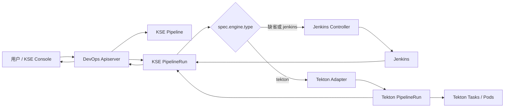
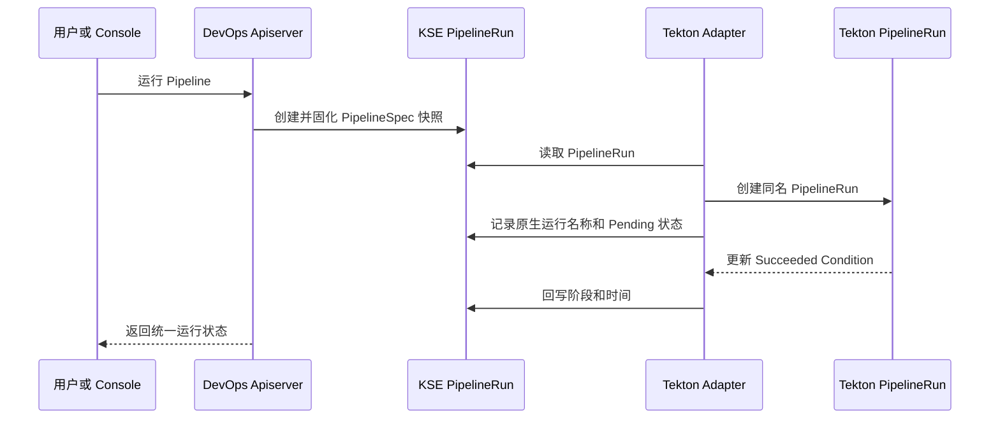

# KubeSphere DevOps 双引擎设计报告

> 文档状态：当前设计与 MVP 实现说明
>
> 更新时间：2026-07-30
> 适用范围：KSE 4.2.x、`kubesphere/ks-devops`、`kubesphere-extensions/devops`

阅读建议：产品和项目负责人可以先阅读第 1～3、12～16 节；后端开发重点阅读第 4～7、10、13 节；前端开发重点阅读第 4、8、11 节。

文中的状态含义：

- **已实现**：当前分支已经存在对应代码。
- **已验证**：已经通过单元测试或真实集群 smoke。
- **目标/建议**：产品化方案，尚未进入正式 Chart 或前端。

## 1. 先看结论

本设计不是用 Tekton 替换 Jenkins，而是在现有 KubeSphere DevOps 控制面下增加第二个流水线执行引擎。

- 原有流水线默认继续使用 Jenkins，已有用户不需要迁移。
- 新流水线可以显式选择 Tekton。
- KubeSphere `Pipeline` 和 `PipelineRun` 继续作为面向用户的统一 API。
- Jenkins 和 Tekton 只负责执行，KSE 继续负责项目、权限、凭证、审计和统一入口。
- 镜像扫描、AI Code Review 等能力应实现为可组合的 Tekton Task，而不是写死在 Controller 中。

当前完成度可以概括为：

| 能力 | 状态 |
| --- | --- |
| Jenkins/Tekton 引擎路由 | 已实现并验证 |
| `spec.engine.type` 与旧 annotation 兼容 | 已实现并通过 CRD 校验 |
| 创建原生 Tekton `PipelineRun` | 已实现并验证 |
| 参数、ServiceAccount、超时、单 Workspace | 已实现 |
| 总体状态同步 | 已实现并验证 |
| 停止 Tekton 流水线 | 已实现并验证 |
| Jenkins 兼容性 | 已完成基本隔离并通过 smoke |
| 镜像安全扫描样例 | 已提供 Trivy 阻断样例 |
| KSE 4.2.x Helm 扩展集成 | 尚未完成 |
| KSE Console Tekton 界面 | 尚未完成 |
| Task 级状态、日志和结果 | 尚未完成 |
| Webhook、定时任务、多分支 | 尚未映射到 Tekton |
| AI Code Review | 只有设计方向，尚未实现 |

因此，这一版本已经证明“双引擎后端可行”，但还不是可以直接交给最终用户使用的完整产品版本。

## 2. 为什么采用双引擎

### 2.1 现有 KSE DevOps

现有 DevOps 主要围绕 Jenkins 构建：

- KSE `Pipeline` 保存流水线配置和 Jenkins 元数据。
- KSE `PipelineRun` 表示一次运行。
- Controller 将资源同步到 Jenkins。
- Apiserver 将 Jenkins 状态转换为 KSE API。
- Console 读取 Jenkins 注解并展示运行详情。

这一模式能够继续服务现有 Jenkinsfile、插件、凭证和多分支流水线，但也导致控制面与 Jenkins 数据结构耦合较深。

### 2.2 行业通用做法

可演进的 CI/CD 平台通常把系统分为三层：

1. **平台控制层**：用户、项目、权限、凭证、审计和统一 API。
2. **流水线编排层**：Pipeline、Task、触发器、制品和策略。
3. **执行层**：Jenkins、Tekton 或其他执行引擎。

这样做的主要价值是：

- 不要求所有用户一次性迁移。
- 平台 API 不必随执行引擎变化。
- 安全扫描、代码检查等步骤可以复用。
- 单个引擎故障或不兼容时，可以按流水线回退。

### 2.3 当前设计的选择

当前方案保留 KSE CRD 作为统一入口，通过 `spec.engine.type` 选择执行引擎，同时兼容 MVP 早期使用的 annotation。这保留了已有对象的兼容性，也让新对象具备强类型校验。

| 维度 | 现有方案 | 行业理想形态 | 当前双引擎设计 |
| --- | --- | --- | --- |
| 用户 API | KSE CRD，但偏 Jenkins | 引擎无关 API | 复用 KSE CRD，增加 engine spec |
| 默认执行器 | Jenkins | 可配置 | Jenkins |
| 新执行器 | 无 | 插件化 | Tekton Adapter |
| 迁移方式 | 整体迁移 | 逐流水线迁移 | 逐 Pipeline 标记 |
| 安全能力 | Jenkins 插件/脚本 | 可组合 Task | 规划为 Tekton Task |
| 风险 | Jenkins 耦合 | 新 API 成本高 | 保留兼容，后续逐步抽象 |

## 3. 总体架构



核心原则：

- KSE `PipelineRun` 是用户看到的统一运行记录。
- Jenkins 和 Tekton 不能同时处理同一个运行。
- 未声明引擎时必须继续走 Jenkins。
- Tekton 原生对象由 KSE 对象拥有，保持生命周期关联。
- Controller 只负责适配和状态同步，不负责实现具体 CI 步骤。

## 4. 两个代码仓库的职责

### 4.1 `kubesphere/ks-devops`

这是后端核心仓库，负责：

- DevOps CRD 和 API。
- Controller 和 Apiserver。
- Jenkins/Tekton 路由。
- Tekton 对象转换和状态同步。
- 后端单元测试与 smoke 测试。

主要构建产物：

- `devops-controller`
- `devops-apiserver`
- `devops-tools`

本次 Tekton 后端改动主要位于该仓库。

### 4.2 `kubesphere-extensions/devops`

这是 KSE 4.2.x DevOps 扩展仓库，负责：

- React/TypeScript 前端。
- KSE Extension 元数据。
- Frontend 和 Agent Helm Chart。
- Controller、Apiserver、Jenkins、Argo CD 的安装。
- CRD、RBAC、镜像版本和扩展发布。

它不应重复实现流水线业务逻辑，而是引用 `ks-devops` 构建出的后端镜像并将它们安装到集群。

```text
ks-devops 源码
    ↓ 构建
Controller / Apiserver 镜像
    ↓ 引用
kubesphere-extensions/devops Helm Chart
    ↓ 发布
KSE 扩展市场
```

## 5. 引擎选择契约

### 5.1 默认行为

新对象使用 Pipeline Spec：

```yaml
spec:
  engine:
    type: tekton
```

规则：

- `spec.engine.type` 为 `jenkins`：Jenkins。
- `spec.engine.type` 为 `tekton`：Tekton。
- 缺少 engine spec 时读取旧 engine annotation。
- 两者都缺少时使用 Jenkins。
- Spec 优先于兼容 annotation。
- KSE API 创建 `PipelineRun` 时保存完整 PipelineSpec 快照，并只复制允许的 Tekton 配置注解。

默认 Jenkins 是整个兼容策略的基础。安装新版本后，用户已有流水线不应因未配置引擎而改变行为。

### 5.2 兼容 annotation

| Annotation | 用途 |
| --- | --- |
| `devops.kubesphere.io/pipeline-engine` | 旧版引擎选择入口；仅用于兼容 |
| `devops.kubesphere.io/tekton-pipeline` | 指定原生 Tekton Pipeline 名称；缺省与 KSE Pipeline 同名 |
| `devops.kubesphere.io/tekton-service-account` | 指定 Tekton TaskRun 使用的 ServiceAccount |
| `devops.kubesphere.io/tekton-timeout` | 指定 Pipeline 超时，例如 `15m` |
| `devops.kubesphere.io/tekton-workspace-name` | 指定 Workspace 名称 |
| `devops.kubesphere.io/tekton-workspace-claim` | 使用指定 PVC 绑定 Workspace |
| `devops.kubesphere.io/tekton-workspace-empty-dir` | 设为 `true` 时使用临时 Workspace |
| `devops.kubesphere.io/tekton-pipelinerun` | 回写原生 Tekton PipelineRun 名称 |

引擎选择优先读取 Spec。其他 Tekton 配置仍使用 annotation，运行对象上的值优先于 Pipeline 上的值。

### 5.3 当前需要改进的校验

CRD 已将 `spec.engine.type` 严格限制为：

```text
jenkins | tekton
```

旧 engine annotation 无法由 CRD OpenAPI 校验，后续应在 admission 或迁移完成后移除该入口。

## 6. Tekton 运行流程

### 6.1 前置资源

MVP 不会把 Jenkinsfile 自动翻译成 Tekton Pipeline。使用 Tekton 前，需要存在一个经过验证的原生 `tekton.dev/v1 Pipeline`。

原因是 Jenkinsfile 是 Groovy 程序，可能包含插件、自定义方法、动态条件和外部状态。自动翻译无法稳定保证语义一致。

### 6.2 创建运行



创建出的原生对象具有以下特点：

- 与 KSE `PipelineRun` 位于同一 namespace。
- 默认使用相同名称。
- 使用 OwnerReference 指向 KSE `PipelineRun`。
- 带有 managed-by label，防止接管不属于自己的同名资源。
- 参数从 KSE `PipelineRun.spec.parameters` 传递。

如果同名 Tekton `PipelineRun` 已存在但不属于该 KSE 运行，Controller 会报错而不是覆盖它。

### 6.3 状态同步

当前同步 Tekton `Succeeded` Condition：

| Tekton Condition | KSE Phase |
| --- | --- |
| 尚无 Condition，尚未开始 | `Pending` |
| 已有开始时间但未结束 | `Running` |
| `Succeeded=True` | `Succeeded` |
| `Succeeded=False` 且为取消原因 | `Cancelled` |
| `Succeeded=False` | `Failed` |
| `Succeeded=Unknown` | `Running` |

同时同步：

- `startTime`
- `completionTime`
- Condition reason
- Condition message
- 最后更新时间

当前采用默认 2 秒轮询。MVP 足够，但大规模使用时应改为监听 Tekton 对象事件或采用更合理的退避策略，避免运行数量增加后产生持续 API 压力。

### 6.4 停止运行

用户通过现有 KSE API 请求停止后：

```yaml
spec:
  action: Stop
```

Adapter 将其转换为：

```yaml
spec:
  status: Cancelled
```

随后 Tekton 的取消状态会同步回 KSE `PipelineRun.status`。

## 7. Jenkins 兼容策略

本设计最重要的兼容要求是：启用 Tekton 后不能改变已有 Jenkins 流水线。

为此进行了两层隔离：

1. Jenkins Pipeline Controller 遇到 Tekton Pipeline 时直接跳过。
2. Jenkins PipelineRun Controller 同时检查运行和被引用 Pipeline，确认属于 Tekton 后不再访问 Jenkins。

因此：

- 没有 engine spec 和兼容 annotation 的旧流水线继续运行。
- Jenkins 运行不会创建同名 Tekton `PipelineRun`。
- Tekton 运行不会创建 Jenkins Build。
- 同一个 KSE `PipelineRun` 只由一个引擎负责。

迁移建议按 Pipeline 进行，而不是按项目或集群一次性切换：

1. 保留已有 Jenkinsfile。
2. 为目标流水线编写并验证 Tekton Pipeline。
3. 在 KSE Pipeline 上设置 `spec.engine.type: tekton`。
4. 验证结果、日志、安全门禁和回滚。
5. 成功后再迁移下一条流水线。

## 8. 一个面向用户的 CI/CD 案例

用户希望将一个 Java 服务从 Git 仓库构建并部署到测试环境：

```text
提交代码
  ↓
拉取代码
  ↓
单元测试
  ↓
AI Code Review
  ↓
构建镜像
  ↓
Trivy 镜像扫描
  ↓
推送镜像
  ↓
更新部署清单或 Helm values
  ↓
部署测试环境
```

在理想的 Console 中，用户只需要：

1. 创建 DevOps 项目。
2. 绑定代码仓库和镜像仓库凭证。
3. 创建流水线并选择 Tekton。
4. 选择或编辑流水线模板。
5. 配置触发条件和部署目标。
6. 查看运行、日志、扫描结果和审批状态。

当前 MVP 已经能承载“运行已有 Tekton Pipeline”和“同步总体结果”，但完整的构建、推送、部署和审批能力仍需要 Task 模板、触发器与前端共同完成。

## 9. 镜像安全检查和 AI Code Review

### 9.1 设计原则

这些能力属于流水线步骤，不属于引擎路由 Controller。

正确的分层方式是：

```text
Controller：选择引擎、创建运行、同步状态
Pipeline：定义步骤顺序和门禁
Task：执行扫描、测试、构建、AI Review
```

这样能够：

- 独立升级扫描器或模型。
- 在不同 Pipeline 中复用。
- 按项目配置凭证和策略。
- 清晰记录输入、输出和失败原因。
- 避免模型调用或扫描逻辑影响 Controller 稳定性。

### 9.2 镜像安全检查

仓库已提供 Trivy 阻断样例：

- 输入一个镜像引用。
- 扫描漏洞和 Secret。
- 发现可修复的 Critical 漏洞时返回非零状态。
- Pipeline 因安全门禁失败而停止。

生产化还需要：

- 镜像使用 digest，不只使用 tag。
- 扫描器镜像锁定 digest。
- 内网同步漏洞数据库。
- 生成并保存 SBOM。
- 对镜像签名。
- 在部署阶段增加准入策略。
- 将扫描报告作为结构化结果展示，而不只是日志。

### 9.3 AI Code Review

推荐实现为独立 Task：

1. 拉取 PR/MR 变更。
2. 过滤敏感文件和超大 diff。
3. 调用企业批准的模型服务。
4. 生成结构化问题列表。
5. 回写 GitHub/GitLab Review。
6. 根据策略决定提示或阻断。

必须先明确：

- 模型服务和网络位置。
- 源代码是否允许离开企业网络。
- Token、API Key 和 Git 凭证管理。
- Prompt 注入防护。
- 日志脱敏和审计。
- AI 结论是否允许直接阻断发布。

## 10. 部署设计

### 10.1 已验证的实验拓扑

为了不直接替换重要环境中的正式 Controller，验证期间使用过：

- 独立 Tekton Adapter。
- 独立 Canary Apiserver。
- 统一 Controller Canary。
- Leader Lease 进行受控切换。

这些资源用于验证和回滚，不是最终 Helm 部署形态。

验证结束后，集群恢复为：

- 正式 `devops-controller`：运行 Jenkins 等现有控制器。
- 独立 `devops-tekton-adapter`：运行 Tekton Controller。
- 统一 Controller Canary：0 副本待命。

### 10.2 正式目标拓扑

产品化后不应长期保留第二个 Adapter Deployment。目标是一个统一的 `devops-controller` Deployment，其中同时注册 Jenkins 和 Tekton Controller：

```text
devops-controller
  ├─ Jenkins reconcilers
  ├─ Tekton reconciler
  ├─ GitRepository reconciler
  └─ 其他现有 reconcilers
```

目标 Helm 配置建议：

```yaml
tekton:
  enabled: false
  install: false
```

第一阶段推荐：

- `enabled` 缺省为 `false`。
- 不由 DevOps Chart 自动安装 Tekton。
- 启用时检查 `pipelines.tekton.dev` 和 `pipelineruns.tekton.dev` CRD。
- 使用固定、验证过的 Tekton 版本。
- 缺少依赖时给出明确安装错误，不让 Controller 持续报错。

这样能避免 DevOps 扩展升级时意外升级集群级 Tekton CRD 和 Controller。

### 10.3 Leader Election 和 Lease

正式 Controller 应启用 Leader Election。Lease 不只是 Canary 切换需要，也用于：

- 多副本 Controller 只允许一个实例执行 reconcile。
- 滚动升级期间防止新旧 Pod 同时创建 Jenkins Build 或 Tekton PipelineRun。
- Leader 故障后由备用 Pod 接管。

建议由 Helm 预创建固定名称的 Lease，然后只向 Controller 授予：

```text
get | update | patch
```

不授予 Lease 的 `delete`；如果由 Helm 创建 Lease，也不需要 Controller 拥有 `create`。

如果正式 Controller 和独立 Adapter 暂时并存，它们不能共享同一个 Lease，因为两者都必须工作。最终统一 Controller 后只需要一个 Lease。

Leader Election 只能避免多个 Controller 实例同时工作，不能代替幂等设计。创建外部任务前仍需要检查已有对象和唯一标识。

### 10.4 Tekton RBAC

当前 Adapter 对原生 Tekton `PipelineRun` 需要：

```text
get | list | watch | create | update | patch
```

当前不需要 `delete`：

- 停止运行通过更新 `spec.status` 完成。
- 生命周期清理由 OwnerReference 和 Kubernetes Garbage Collector 负责。

权限应通过 `kubesphere-extensions/devops` Agent Chart 安装，而不是要求用户手工执行 YAML。

### 10.5 多集群演进

当前 DevOps 扩展是 `Multicluster` 安装模式，但成员 Agent 同时包含 Apiserver、Controller、Jenkins 和 Argo CD，且 APIService 指向成员集群本地 `devops-apiserver`。因此不能仅通过停止成员 Agent 实现中央化。

推荐演进为：

1. 第一阶段由管理集群集中运行 DevOps、Jenkins、Tekton 和 GitOps 控制面，成员集群只作为部署目标。
2. 第二阶段为确有隔离或算力需求的集群提供轻量 Tekton Runner，不安装完整 DevOps 和 Jenkins。
3. 复用 KSE `Cluster` CR 作为集群身份，不把 kubeconfig 写入 Pipeline/PipelineRun。
4. Pipeline 的引擎和执行位置进入 spec，PipelineRun 保存执行快照及远端 nativeRef。
5. DevOps API 和 CR 归属管理集群，不能继续依赖成员集群本地 APIService。

详细设计见 [Tekton 多集群设计](./tekton-multicluster-design.md)。

## 11. 前端设计

### 11.1 当前前端状态

当前 `kubesphere-extensions/devops` 前端仍明显依赖 Jenkins：

- Pipeline mapper 读取 Jenkins metadata annotation。
- PipelineRun mapper 读取 Jenkins run status 和 Jenkins run ID。
- 运行详情复用旧版 Jenkins 流水线页面。
- 创建页面没有 Jenkins/Tekton 选择。
- 目前没有 Tekton Task、日志、结果和 Workspace 界面。

所以，当前已经安装的 KSE Console 不能直接使用新 Tekton 后端。

### 11.2 最小可用前端

第一版前端建议只实现：

1. Pipeline 创建/编辑页增加执行引擎选择。
2. Tekton Pipeline 名称或 YAML 配置入口。
3. 运行列表读取 KSE `PipelineRun.status`，不再只解析 Jenkins annotation。
4. 运行和取消操作复用现有 DevOps API。
5. Tekton 运行详情显示总体状态、开始时间、完成时间和失败信息。

第二版再增加：

- TaskRun 拓扑。
- Pod 日志。
- Task results。
- 扫描报告。
- AI Review 结果。
- 重试、跳过、审批和制品。

前端不应直接拼接 Tekton Kubernetes API。推荐由 DevOps Apiserver 提供稳定的引擎无关接口，再由后端访问 Tekton TaskRun、Pod 日志或 Tekton Results。

## 12. 测试与验证结果

### 12.1 单元测试

2026-07-30 已通过：

```text
./pkg/pipelineengine
./controllers/tekton
./pkg/kapis/devops/v1alpha3/pipelinerun
./cmd/controller/app/options
```

覆盖内容包括：

- 默认 Jenkins。
- Annotation 传播。
- Tekton 对象构造。
- 参数、Workspace、ServiceAccount 和超时。
- 同名资源归属检查。
- 状态转换。
- 停止操作。
- Tekton Controller 注册开关。

### 12.2 集群验证

在 KSE 4.2.1 测试环境完成过以下验证：

- 原生 Tekton PipelineRun 成功。
- KSE PipelineRun 创建同名 Tekton PipelineRun。
- Tekton 成功状态回写 KSE。
- KSE 停止操作转换为 Tekton Cancelled。
- Canary Apiserver 可以通过 KSE REST API 创建和查询运行。
- 统一 Controller 接管期间，Jenkins smoke 成功。
- 同一期间 Tekton smoke 成功。
- Jenkins 运行没有创建同名 Tekton 运行。
- 测试完成后恢复原 Controller 与独立 Adapter 拓扑。

验证过的代表性运行：

| 类型 | 运行 | 结果 |
| --- | --- | --- |
| Jenkins | `jenkins-smoke-g4hpv` | Succeeded |
| Tekton | `smoke-demo-m8gxs` | Succeeded |
| Tekton cancel | `cancel-demo-run` | Cancelled |

这证明了路由和基本兼容性，但不等同于完成生产级压力、故障恢复和升级测试。

## 13. 已知限制和风险

### 13.1 API 模型仍偏 Jenkins

KSE Pipeline CRD 中存在 Jenkinsfile、SCM 和 Jenkins metadata 等结构。当前已经加入最小的 engine spec，但 Tekton 详细配置仍使用 annotation。如果 Tekton 能力持续扩展，后续需要评估：

- 扩展现有 CRD 的 engine-specific spec。
- 新建独立 PipelineDefinition CRD。
- 或将原生 Tekton Pipeline 作为主要定义，KSE 只保存引用。

### 13.2 参数和 Workspace 能力有限

当前仅支持：

- 字符串参数。
- 一个 Workspace。
- PVC 或 emptyDir。

尚不支持：

- 数组和对象参数。
- 多 Workspace。
- Workspace 的 Secret、ConfigMap、VolumeClaimTemplate。
- Matrix、PipelineSpec 内联定义等高级能力。

### 13.3 只同步总体状态

当前没有同步：

- TaskRun 列表和状态。
- Step 状态。
- Pod 和容器日志。
- Tekton Results。
- 产物和扫描报告。

这会限制前端体验，也是下一阶段最重要的 API 工作。

### 13.4 触发能力未完成

当前 Jenkins 的 SCM、多分支、定时触发尚未映射到：

- Tekton Triggers。
- EventListener。
- TriggerBinding。
- TriggerTemplate。

正式设计还需决定继续复用 KSE GitRepository/Webhook Controller，还是引入 Tekton Triggers 作为执行层。

### 13.5 运行规模

每个非终态运行默认每 2 秒轮询一次。大量并发运行时可能增加 Apiserver 压力。应增加：

- 原生对象事件监听。
- 指数退避。
- Controller 并发配置。
- 指标和告警。
- Tekton Results 持久化。

### 13.6 安装和版本兼容

Tekton 是集群级组件，涉及 CRD、Webhook 和多个 Controller。需要明确：

- 支持的 Kubernetes 版本。
- 支持的 Tekton 版本范围。
- CRD 升级策略。
- 离线镜像清单。
- amd64/arm64 镜像验证。
- DevOps 扩展卸载时是否保留 Tekton。

## 14. 推荐的产品化路线

### 阶段一：完成后端提交

- Review 并提交 `ks-devops` 改动。
- 增加未知 engine 校验。
- 增加并发 reconcile 和冲突场景测试。
- 明确 Tekton 版本兼容范围。

验收：后端 PR 可独立构建，定向测试通过，默认 Jenkins 行为不变。

### 阶段二：完成 Helm 扩展

在 `kubesphere-extensions/devops` 中：

- 增加 `tekton.enabled`。
- 更新 Controller 和 Apiserver 镜像。
- 增加 Tekton RBAC。
- 增加 Leader Lease 和 Leader Election 参数。
- 增加 Tekton CRD 前置检查。
- 更新 `extension.yaml` 镜像清单和版本。
- 不包含 Canary 和独立 Adapter。

验收：新装、升级、禁用和回滚均不会影响已有 Jenkins 流水线。

### 阶段三：完成最小前端

- 增加引擎选择。
- 增加 Tekton Pipeline 配置入口。
- 运行列表改为优先读取统一状态。
- 增加 Tekton 总体状态和取消操作。

验收：用户不使用 kubectl，即可在 Console 创建并运行一条 Tekton Pipeline。

### 阶段四：提供真实 CI 模板

至少提供：

```text
git-clone → unit-test → build-image → trivy → push-image
```

验收：能够在离线或受限网络环境中完成真实镜像构建与安全门禁。

### 阶段五：企业能力

- Tekton Results。
- 日志与制品持久化。
- Webhook 和多分支。
- 审批和策略。
- SBOM、签名和准入。
- AI Code Review。
- 配额、审计、指标和告警。

### 阶段六：多集群集中化

- 增加中央 `control-plane`、兼容 `legacy-agent` 和轻量 `tekton-runner` 安装档位。
- DevOps API 与 CR 收敛到管理集群。
- 成员集群默认只作为 GitOps Target，不安装完整 DevOps。
- 第二阶段再实现远程 Tekton PipelineRun 派发、状态同步、日志结果和凭证治理。

验收：目标集群无需 Jenkins/Tekton 即可接收部署；远程 Runner 只安装轻量 Tekton，且网络中断或 Controller 重启不会重复运行。

## 15. 当前不应做的事情

- 不应删除 Jenkins 或把已有流水线批量改成 Tekton。
- 不应自动翻译任意 Jenkinsfile。
- 不应让两个 Controller 同时处理同一个 PipelineRun。
- 不应把 Canary、Adapter 和手工切换 YAML作为正式安装方式。
- 不应让前端绕过 DevOps API 直接拥有宽泛的 Tekton 权限。
- 不应把 Trivy、AI 模型等业务逻辑写进 Controller。
- 不应在重要环境中自动升级未知版本的 Tekton CRD。

## 16. Review 时建议重点确认

1. 默认 Jenkins 是否是长期兼容策略。
2. 第一版是否只支持外部安装的 Tekton。
3. KSE Pipeline 与原生 Tekton Pipeline 是否继续使用名称映射。
4. Tekton 详细配置从 annotation 迁入 engine-specific spec 的版本边界。
5. 前端第一版是否只做总体状态，不立即实现 Task 详情和日志。
6. Tekton 版本支持范围和离线镜像责任由哪个团队维护。
7. AI Code Review 的模型、数据和凭证安全边界。

## 17. 代码索引

后端核心：

- `pkg/pipelineengine/engine.go`：引擎 Spec 与兼容 annotation 的解析契约。
- `controllers/tekton/pipelinerun_controller.go`：Tekton Adapter。
- `cmd/controller/app/controllers.go`：Controller 注册。
- `controllers/jenkins/`：Jenkins 隔离逻辑。
- `pkg/kapis/devops/v1alpha3/pipelinerun/`：API 创建、PipelineSpec 快照与兼容 annotation 传播。
- `config/rbac/role.yaml`：Tekton 后端权限源定义。
- `config/samples/tekton/`：Tekton 和安全扫描样例。
- `hack/smoke-tekton-mvp.sh`：集群 smoke 测试。

扩展产品化：

- `kubesphere-extensions/devops/charts/devops/extension.yaml`：扩展元数据和镜像清单。
- `kubesphere-extensions/devops/charts/devops/charts/agent/`：后端 Helm Chart。
- `kubesphere-extensions/devops/charts/devops/charts/frontend/`：前端 Helm Chart。
- `kubesphere-extensions/devops/web/extensions/devops/`：KSE Console DevOps 前端。

---

本报告描述的是当前已经验证的设计和实现边界。正式发布前，仍需完成 Helm 扩展、前端接入、升级回滚、规模测试和安全评审。
