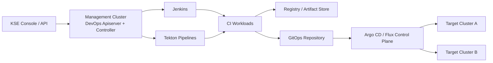
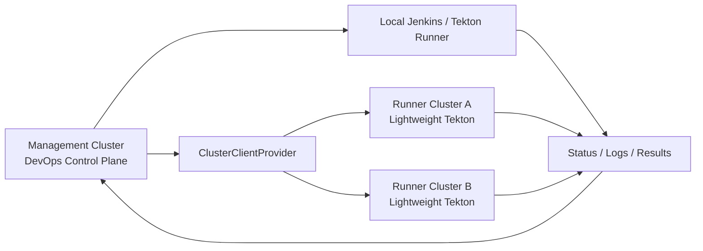

# KubeSphere DevOps Tekton 多集群设计

> 状态：设计草案，不代表当前代码已经实现
>
> 日期：2026-07-30
> 相关报告：[Tekton DevOps 双引擎设计](./tekton-devops-design-report.md)

## 1. 决策摘要

本设计解决两个问题：

1. KSE DevOps 不再要求每个成员集群安装完整的 Jenkins、DevOps Controller、Apiserver 和 Argo CD。
2. 在保留 Jenkins 兼容性的前提下，引入 Tekton，并为后续远程 Runner 留出标准模型。

推荐按两个阶段落地：

- 第一阶段：管理集群集中运行 KSE DevOps、Jenkins、Tekton 和 GitOps 控制面；成员集群只作为部署目标。
- 第二阶段：有隔离或算力需求的成员集群可以选择安装轻量 Tekton Runner；管理集群负责派发和汇总。

关键决策：

- 复用 KSE 已有的 `cluster.kubesphere.io/v1alpha1 Cluster` 作为集群身份和连接来源。
- 不创建重复保存 kubeconfig 的 Runner CRD，也不把 kubeconfig 写入 Pipeline、PipelineRun 或 Task。
- 用户选择的引擎和执行位置进入 `spec`；annotation 只用于 MVP 兼容和内部元数据。
- PipelineRun 保存执行快照；已经创建的运行不会因 Pipeline 后续变更而切换引擎或 Runner。
- CI 执行位置与 CD 部署目标分开建模。Pipeline 不直接保存一组部署集群。
- 现有 Jenkins 是默认引擎，已有 Pipeline 在升级后行为不变。
- 第一阶段不自动把已有成员集群 DevOps 安装切换为集中模式。

## 2. 术语

| 角色 | 职责 | 是否运行 CI 引擎 |
|---|---|---|
| Management Cluster | 保存 KSE DevOps CR、提供 API/UI、调度运行、汇总状态 | 是 |
| Runner Cluster | 执行编译、测试、镜像构建和扫描 | 是，Jenkins Agent 或 Tekton |
| Target Cluster | 接收应用部署 | 否 |
| Kubernetes Control Plane Node | 运行 kube-apiserver、scheduler 等 Kubernetes 控制面 | 与 CI/CD 集群角色无直接关系 |
| Kubernetes Worker Node | 承载 Pod | 与 CI/CD 集群角色无直接关系 |

同一个 Kubernetes 集群可以同时承担 Management、Runner 和 Target 角色。集群角色是产品与调度概念，不等同于节点角色。

## 3. 行业通用做法

### 3.1 控制面与执行面分离

成熟 CI/CD 平台通常将流水线定义、权限、审计和调度集中管理，把任务执行下沉到 Runner。这样可以：

- 减少每个目标集群的常驻组件。
- 统一模板、策略、凭证和审计。
- 让 Runner 按安全域、架构、地域或算力分类。
- 独立扩缩容执行资源，不影响管理 API。

### 3.2 CI 与 CD 分离

推荐流程是：

```text
代码提交
  → CI Runner：测试、构建、扫描、签名、推送制品
  → 更新部署仓库或发布对象
  → GitOps Controller：部署到 Target Cluster
```

CI Pipeline 负责产生可信制品和发布意图；Argo CD 或 Flux 负责持续收敛目标集群。这样能避免构建任务长期持有多个生产集群的高权限 kubeconfig。

### 3.3 集群引用与凭证分离

业务 CR 只引用逻辑集群名称。连接凭证由平台集中管理，并按最小权限生成客户端。凭证不应复制给 Task 容器，也不应散落在每个 DevOps Project Namespace。

### 3.4 不跨集群模拟 OwnerReference

Kubernetes OwnerReference 只在同一集群内有效。跨集群运行必须通过显式状态、唯一键和 finalizer 管理，不能依赖远端垃圾回收自动完成一致性。

## 4. 对现有方案的评估

### 4.1 同事建议的方向

“只在一个集群安装 DevOps，通过其他集群的 kubeconfig 把它们作为 Runner 或 Target”方向正确，但 Runner 与 Target 必须区分：

- Target Cluster 不需要安装 Jenkins 或 Tekton。
- Runner Cluster 必须存在任务运行时。Tekton Runner 至少需要 Tekton CRD、Controller、Webhook 和执行所需 RBAC。
- kubeconfig 应由控制面使用，不应直接交给流水线步骤。

### 4.2 当前 KSE 的实际模型

当前 `kubesphere-extensions/devops` 声明 `installationMode: Multicluster`，Agent Chart 包含：

- DevOps Apiserver。
- DevOps Controller。
- Jenkins。
- Argo CD。
- CRD、RBAC 和相关服务。

Agent 在所在集群注册指向本地 `devops-apiserver` Service 的 `APIService`。前端请求路径又带有 `klusters/:cluster`。因此当前模型实质是“成员集群本地 DevOps 后端”，并非中央 DevOps 自动管理所有成员集群。

直接停止成员集群 Agent 会让现有 API 路由失去后端。集中化不仅是 Helm 裁剪，还需要改变 API 和 CR 的归属。

### 4.3 KSE 已有多集群能力

KSE 已有 `cluster.kubesphere.io/v1alpha1 Cluster`：

- 支持 `Direct` 和 `Proxy` 连接模式。
- 保存 Kubernetes/KubeSphere API 端点和连接信息。
- ClusterClient 可以生成 `rest.Config`、Kubernetes Client 和 controller-runtime Client。
- KSE Apiserver 可以按 `clusters/{cluster}` 路径转发用户请求。

这些能力可以作为集群身份与客户端基础，但当前 KSE HTTP 转发过滤器不是 ks-devops Reconciler 可直接调用的远程调度接口。ks-devops 仍需要独立的 `ClusterClientProvider` 抽象。

### 4.4 现有 Flux 多集群实现

ks-devops 当前会把每个 Cluster 的 kubeconfig 复制到每个 DevOps Project Namespace 的 Secret 中，供 Flux 使用。

这个实现证明 KSE 已有集群来源，但不建议直接复制到远程 Runner：

- 凭证副本数量随项目和集群乘积增长。
- 任意获得该 Secret 的 Task 可能取得目标集群权限。
- 凭证轮换和吊销成本高。
- Proxy 集群的可用性还取决于实际连接数据和代理链路。

## 5. 目标架构

### 5.1 第一阶段：集中控制、集中执行、远程部署



特点：

- KSE Pipeline、PipelineRun 和 DevOps Project 统一保存在管理集群。
- Jenkins 与 Tekton 都在管理集群运行。
- 成员集群不安装完整 DevOps Agent，仅作为 GitOps Target。
- PipelineRun 的默认执行集群是管理集群。
- 现有每集群模式继续保留，集中模式通过显式安装档位启用。

这一步已经能解决大部分“每个集群安装完整 DevOps 太重”的问题。

### 5.2 第二阶段：可选远程 Tekton Runner



轻量 Runner 安装档位只包含：

- Tekton Pipelines 运行时，或对已有 Tekton 进行版本检查。
- 最小的 KSE Runner ServiceAccount 和 RBAC。
- 可选日志、Results 或缓存组件。
- 不包含 Jenkins、DevOps Apiserver、完整 DevOps Controller 和 Argo CD。

中央 Controller 负责：

- 解析 `execution.clusterRef`。
- 在目标 Runner 创建原生 Tekton PipelineRun。
- 保存远端对象 UID。
- 轮询或 Watch 状态并同步到 KSE PipelineRun。
- 处理取消、超时、连接失败、重试和最终清理。

## 6. API 设计

### 6.1 PipelineSpec

当前分支已经实现最小的 `spec.engine.type`，并保留旧 annotation 兼容。下面的 Tekton 详细配置和 execution 字段仍是产品化目标：

```yaml
apiVersion: devops.kubesphere.io/v1alpha3
kind: Pipeline
metadata:
  name: java-build
  namespace: demo
spec:
  type: pipeline
  engine:
    type: tekton
    tekton:
      pipelineRef:
        name: java-build
      serviceAccountName: builder
      timeout: 30m
      workspaces:
        - name: source
          claimTemplateRef:
            name: source-workspace
  execution:
    clusterRef:
      name: host
    namespace: demo
```

建议类型关系：

```text
PipelineSpec
  ├─ engine: PipelineEngineSpec
  │    ├─ type: jenkins | tekton
  │    ├─ jenkins: JenkinsEngineSpec
  │    └─ tekton: TektonEngineSpec
  └─ execution: PipelineExecutionSpec
       ├─ clusterRef.name
       └─ namespace
```

规则：

- `engine.type` 为空时默认为 `jenkins`，保证已有对象兼容。
- `engine.type` 使用 CRD enum；未知值在准入阶段拒绝。
- 只能设置与 `engine.type` 对应的配置块。
- `execution.clusterRef` 为空时默认当前管理集群。
- `execution.namespace` 为空时默认 KSE Pipeline 所在 Namespace。
- `clusterRef` 引用 KSE `Cluster` 名称，不包含 kubeconfig。
- 第一阶段只允许本地执行；字段提前稳定，但远程 Runner 由 feature gate 控制。

### 6.2 PipelineRunSpec

当前 PipelineRun 已保存 `pipelineSpec` 快照。产品化时应保证其中包含 engine 和 execution，并显式记录最终调度结果：

```yaml
spec:
  pipelineRef:
    name: java-build
  pipelineSpec:
    engine:
      type: tekton
      tekton: {}
    execution:
      clusterRef:
        name: runner-amd64
      namespace: demo
  parameters:
    - name: revision
      value: main
```

建议第一版不允许创建 PipelineRun 时任意覆盖 `clusterRef`。Runner 由 Pipeline 或平台策略确定，防止普通项目成员绕过隔离、配额和成本策略。后续如需覆盖，应由独立字段表达并经过 RBAC/Admission 校验。

### 6.3 PipelineRunStatus

原生引擎运行身份属于观测结果，应写入 status，而不是 annotation：

```yaml
status:
  phase: Running
  engine: tekton
  execution:
    clusterRef:
      name: runner-amd64
    namespace: demo
    nativeRef:
      apiVersion: tekton.dev/v1
      kind: PipelineRun
      name: java-build-x7k2m
      uid: 6bf9...
  conditions:
    - type: Scheduled
      status: "True"
      reason: RunnerAvailable
    - type: Succeeded
      status: Unknown
      reason: Running
```

状态至少需要区分：

- Runner 未找到或不允许使用。
- Runner 暂时不可达。
- Runner 缺少 Tekton CRD 或版本不兼容。
- 原生 Pipeline/PipelineRun 不存在。
- 原生运行已创建、运行、成功、失败或取消。
- 状态同步延迟。

### 6.4 为什么不继续使用 annotation

`spec` 适合用户声明的长期契约，可由 OpenAPI 校验、前端生成、GitOps Diff 和策略引擎识别。annotation 没有强类型和结构校验，容易拼写错误，也无法稳定表达多集群、Workspace、超时和运行策略。

迁移期读取顺序建议：

1. 有 `spec.engine` 时使用 spec。
2. 否则读取 MVP engine annotation。
3. 两者都没有时使用 Jenkins。
4. 新版 Apiserver 写 spec，不再主动写 annotation。
5. 经过一个兼容周期后再移除 annotation 入口。

## 7. API 与资源归属改造

集中模式下，Console 对任意成员集群上下文发起 DevOps 请求时，最终都应落到管理集群 DevOps Apiserver。建议提供两种兼容路径之一：

### 7.1 推荐：DevOps 资源归管理集群

- DevOps Project、Pipeline 和 PipelineRun 只创建在管理集群。
- 前端的 DevOps 模块使用管理集群 API，不再把当前工作负载集群当作 CR 存储位置。
- Target Cluster 作为表单字段或 GitOps Application 的 destination，而不是 API 路由目的地。
- 现有 `klusters/:cluster` 路由在集中模式下由 Apiserver 解释为上下文或兼容参数，不再转发到成员 DevOps Agent。

优点是资源归属明确，最符合集中控制面模型。

### 7.2 不推荐：透明代理保持成员资源归属

继续把 Pipeline CR 分散在成员集群，再由管理集群代理 reconcile，会导致：

- 每个成员仍需 DevOps CRD。
- Watch、缓存和故障恢复复杂。
- 项目列表、审计、配额和日志需要跨集群聚合。
- 集中控制面收益有限。

因此它只适合作为迁移兼容，不作为最终模型。

## 8. ClusterClientProvider

ks-devops 应定义引擎无关的客户端抽象，例如：

```text
ClusterClientProvider
  ├─ GetRuntimeClient(clusterName)
  ├─ GetRESTConfig(clusterName)
  ├─ CheckReady(clusterName)
  └─ CheckCapability(clusterName, capability)
```

实现要求：

- 复用 KSE Cluster 身份、连接模式和凭证轮换。
- 缓存按 Cluster resourceVersion 或连接信息变化失效。
- 连接失败不得阻塞其他 Runner 的 reconcile。
- 对 Direct 和 Proxy 连接分别做集成测试。
- Controller 只获得目标 Namespace 内 Tekton 所需权限。
- Task Pod 不继承中央控制面的远程集群凭证。

当前 UFL `clusterclient` 可以作为实现参考或依赖，但接入前必须确认：

- Proxy Cluster 的 kubeconfig 在运行时是否完整且可直接使用。
- ks-devops 进程能否依赖 UFL 内部包或需要抽出公共 API。
- Client 缓存、凭证轮换和网络超时是否满足长时间 Controller 运行。

## 9. 跨集群运行生命周期

### 9.1 幂等创建

中央 KSE PipelineRun UID 应作为远端原生 PipelineRun 的稳定标签或 annotation。Reconcile 顺序：

1. 检查 status 中已保存的 nativeRef。
2. 按 UID 标签查找可能已创建但尚未回写 status 的对象。
3. 只在两者都不存在时创建。
4. 创建成功后保存远端 name 和 UID。

这样能覆盖 Controller 在“远端创建成功、中央状态写入失败”之间崩溃的情况。

### 9.2 取消

取消 Tekton PipelineRun 应更新其受支持的取消字段，不依赖删除。中央状态在远端确认取消后进入终态；Runner 不可达时记录 `CancelPending`。

### 9.3 最终清理

跨集群不能使用 OwnerReference。中央 PipelineRun 删除时：

- finalizer 发起远端清理或保留策略。
- Runner 不可达时采用有限重试和明确的 orphan 策略。
- 不允许 finalizer 无限阻塞 Namespace 删除。
- 审计记录必须保留远端身份和最终处理结果。

### 9.4 状态、日志和结果

MVP 可以由中央 Controller Watch 或轮询远端 PipelineRun。生产版建议引入 Tekton Results 或统一日志后端，避免长期依赖远程 Pod 日志：

- KSE PipelineRun status 保存摘要。
- TaskRun 拓扑按需查询或缓存。
- 日志写入 Loki/对象存储等统一后端。
- 制品、SBOM、扫描和 AI Review 使用结构化结果引用。

## 10. 安全边界

- 管理集群 Controller 不使用平台管理员 kubeconfig执行日常任务。
- 每个 Runner 使用专用 ServiceAccount 和 Namespace 范围 RBAC。
- 普通 Pipeline Task 无权读取 Cluster CR 的连接凭证。
- Runner 选择必须经过项目权限、允许列表、配额和策略校验。
- 生产 Target 凭证由 GitOps Controller 管理，不传入构建 Pod。
- Secret、日志、扫描报告和 AI Review 输入需要脱敏。
- 跨集群请求记录用户、项目、PipelineRun、Runner 和 native UID。

## 11. Helm 安装档位

扩展 Chart 建议明确三种安装 Profile，并把无需安装 Release 的目标集群标记为 `target-only`，而不是用多个松散布尔值组合出未知状态：

| Profile | 安装内容 | 使用场景 |
|---|---|---|
| `legacy-agent` | 当前完整 Agent、Jenkins、Apiserver、Controller、Argo CD | 兼容已有每集群安装 |
| `control-plane` | 中央 Apiserver、Controller、前端、Jenkins/Tekton/GitOps 可选 | 新集中模式 |
| `tekton-runner` | Tekton 运行时、Runner RBAC、可选 Results/日志组件 | 第二阶段远程执行 |
| `target-only` | 不安装 DevOps；仅由 GitOps 注册目标 | 部署目标集群 |

注意：`target-only` 是逻辑档位，不一定需要创建 Helm Release。

升级原则：

- 已有安装默认保持 `legacy-agent`，不静默迁移。
- 新装可以显式选择 `control-plane`。
- Tekton CRD 和 Controller 版本必须固定并通过兼容矩阵校验。
- 卸载 DevOps 时默认保留 Tekton CRD 和历史运行，避免级联数据损失。

## 12. 模板与步骤目录

Tekton 的灵活性应通过版本化 Catalog 提供，不把具体工具逻辑写入 DevOps Controller。

建议分层：

- Task：git clone、单元测试、构建镜像、Trivy、SBOM、签名、AI Review、GitOps 更新。
- Pipeline Template：Java、Go、Node、容器镜像、安全发布等组合。
- Policy：必须扫描、严重漏洞阈值、签名、审批、允许的 Runner。
- Environment/Delivery Template：开发、测试、生产的 GitOps 发布策略。

模板必须固定版本或 digest，声明所需 Workspace、Secret、网络和权限，并提供离线镜像清单。

## 13. 迁移路线

### 阶段 0：完成本地双引擎

- 合并当前 Tekton MVP 后端。
- 保持默认 Jenkins。
- 完成 Helm RBAC、Feature Gate 和前端最小接入。
- `engine.type` 已从 annotation 迁入 spec；继续迁移 Tekton 详细配置。

验收：同一管理集群中 Jenkins 与 Tekton Pipeline 可并存，已有 Pipeline 行为不变。

### 阶段 1：集中控制面和 Target-only

- 增加 `control-plane` 安装档位。
- DevOps CR 和 API 收敛到管理集群。
- 前端区分 CI 执行集群与 CD 目标集群。
- 通过现有 KSE Cluster + GitOps 管理 Target。
- 验证已有 `legacy-agent` 与新模式可以并存。

验收：新成员集群不安装完整 DevOps，也能作为应用部署目标；已有成员 DevOps 不受影响。

### 阶段 2：轻量 Tekton Runner

- 增加 `tekton-runner` Profile。
- 实现 ClusterClientProvider 和远程 PipelineRun 生命周期。
- 增加 Runner capability、健康状态、配额和策略。
- 完成日志、结果和离线镜像方案。

验收：中央 PipelineRun 可稳定派发到指定 Runner，网络中断和 Controller 重启不会产生重复运行。

### 阶段 3：企业能力

- Runner 自动选择和队列调度。
- 模板与 Task Catalog。
- Tekton Results、制品、SBOM、签名和策略门禁。
- AI Code Review 的凭证、隐私、审计和结果模型。
- 多租户资源隔离、成本统计、SLO 和容量规划。

## 14. 暂不实现的内容

- 不自动翻译 Jenkinsfile 为 Tekton Pipeline。
- 不让 Jenkins Job 直接调度到只安装 Tekton 的 Runner。
- 不把 Target Cluster 当作默认 CI Runner。
- 不把远程集群 kubeconfig 注入普通 Task。
- 不在第一阶段实现自动跨集群 Runner 选择。
- 不在未完成 API 归属改造前卸载成员集群 DevOps Agent。

## 15. 需要评审的决策

1. 集中模式下 DevOps Project 是否全部归管理集群，答案建议为“是”。
2. 第一阶段是否只支持本地 Runner，答案建议为“是”。
3. PipelineRun 是否允许用户覆盖 Runner，答案建议第一版为“否”。
4. 远程 Runner 是否仅支持 Tekton，答案建议第一版为“是”。
5. Tekton 由 DevOps 安装还是只检测外部安装，需要产品与运维共同决定。
6. Proxy Cluster 的 Controller 访问方式需要 UFL 团队确认并做集成测试。
7. 现有 Flux kubeconfig Secret 复制机制是否同步重构，需要单独安全评审。

## 16. 代码依据

- KSE Cluster 类型：`unified-foundation-layer/staging/src/kubesphere.io/api/cluster/v1alpha1/types.go`
- KSE 多集群 HTTP 转发：`unified-foundation-layer/pkg/apiserver/filters/multicluster.go`
- KSE ClusterClient：`unified-foundation-layer/pkg/utils/clusterclient/clusterclient.go`
- Flux 多集群 Secret 同步：`ks-devops/controllers/fluxcd/multi-cluster-controller.go`
- Pipeline API：`ks-devops/pkg/api/devops/v1alpha3/pipeline_types.go`
- PipelineRun API：`ks-devops/pkg/api/devops/v1alpha3/pipelinerun_types.go`
- DevOps 扩展安装模式：`devops/charts/devops/extension.yaml`
- 成员 Agent APIService：`devops/charts/devops/charts/agent/templates/extensions.yaml`
- 前端 PipelineRun 路由：`devops/web/extensions/devops/src/stores/pipelineruns.ts`

---

本设计的核心不是“用 Tekton 替换 Jenkins”，而是把 KSE DevOps 从每集群完整安装，演进为集中控制、按需执行、独立交付的多集群平台。
